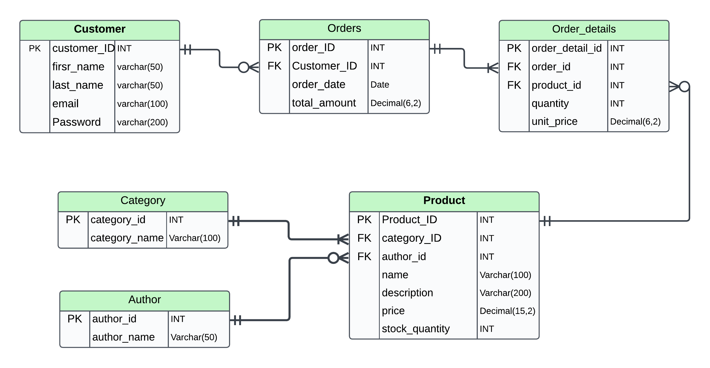

# **E-Commerce_DB**
E-commerce data base for trading of goods and services online

## Table of Contents
-[ERD](#ERD-diagram-with-relationships-between-entities)
-[DB Schema](#DB-schema-script)
-[Queries](#DB-Queries)

## ERD diagram with relationships between entities


## DB schema script
- Create Categories Table
```sql
CREATE TABLE `category` (
  `category_id` int NOT NULL AUTO_INCREMENT,
  `category_name` varchar(100) NOT NULL,
  PRIMARY KEY (`category_id`)
)
```

- Create Products Table
```sql
 CREATE TABLE `product` (
  `product_id` int NOT NULL AUTO_INCREMENT,
  `category_id` int DEFAULT NULL,
  `name` varchar(100) NOT NULL,
  `description` varchar(200) NOT NULL,
  `price` decimal(15,2) NOT NULL,
  `stock_quantity` int NOT NULL,
  `author_id` int DEFAULT NULL,
  PRIMARY KEY (`product_id`),
  KEY `category_id` (`category_id`),
  KEY `authour_fk` (`author_id`),
  CONSTRAINT `authour_fk` FOREIGN KEY (`author_id`) REFERENCES `author` (`author_id`),
  CONSTRAINT `product_ibfk_1` FOREIGN KEY (`category_id`) REFERENCES `category` (`category_id`),
  CONSTRAINT `stock_quantity` CHECK ((`stock_quantity` >= 0)) 
 )
```
- Create Customers Table
```sql
  CREATE TABLE `customer` (
  `customer_id` int NOT NULL AUTO_INCREMENT,
  `first_name` varchar(50) NOT NULL,
  `last_name` varchar(50) NOT NULL,
  `email` varchar(100) NOT NULL,
  `password` varchar(200) NOT NULL,
  PRIMARY KEY (`customer_id`),
  UNIQUE KEY `email` (`email`)
  ) 
```  
- Create Orders Table
```sql
  CREATE TABLE `orders` (
  `order_id` int NOT NULL AUTO_INCREMENT,
  `customer_id` int DEFAULT NULL,
  `order_date` date NOT NULL,
  `total_amount` decimal(6,2) DEFAULT NULL,
  PRIMARY KEY (`order_id`),
  KEY `customer_id` (`customer_id`),
  CONSTRAINT `orders_ibfk_1` FOREIGN KEY (`customer_id`) REFERENCES `customer` (`customer_id`),
  CONSTRAINT `total_amount` CHECK ((`total_amount` >= 0))
 )
```
- Create Orders Details Table
```sql
  CREATE TABLE `order_details` (
  `order_detail_id` int NOT NULL AUTO_INCREMENT,
  `order_id` int DEFAULT NULL,
  `product_id` int DEFAULT NULL,
  `quantity` int NOT NULL,
  `unit_price` decimal(6,2) NOT NULL,
  PRIMARY KEY (`order_detail_id`),
  KEY `order_id` (`order_id`),
  KEY `product_id` (`product_id`),
  CONSTRAINT `order_details_ibfk_1` FOREIGN KEY (`order_id`) REFERENCES `orders` (`order_id`),
  CONSTRAINT `order_details_ibfk_2` FOREIGN KEY (`product_id`) REFERENCES `product` (`product_id`),
  CONSTRAINT `order_details_chk_1` CHECK ((`quantity` >= 0))
)
```
- Create Author Table
```sql
CREATE TABLE `author` (
  `author_id` int NOT NULL AUTO_INCREMENT,
  `author_name` varchar(50) NOT NULL,
  PRIMARY KEY (`author_id`)
)
```
## DB Queries
- Generate a daily report of the total revenue for a specific date.
   
```sql
SELECT sum(total_amount) AS DAILY_REVENUE ,
       DATE(order_date) AS ORDER_DATE
FROM orders
WHERE DATE(Order_date) = '2024-12-20'
GROUP BY order_date;
```
- Generate a monthly report of the top-selling products in a given month.
```sql
SELECT p.name,
       sum(od.quantity) AS quantity_sold,
       sum(od.quantity * od.unit_price) AS total_revenue,
       date_format(order_date, '%Y-%m') AS MONTH
FROM orders o
JOIN order_details od ON o.order_id = od.order_id
JOIN product p ON od.product_id = p.product_id
WHERE date_format(o.order_date, '%Y-%m') = '2024-12'
GROUP BY p.product_id,
         p.name,
         MONTH
ORDER BY sum(od.quantity) DESC,total_revenue DESC;
```
- Retrieve a list of customers who have placed orders totaling more than $500 in the past month Include customer names and their total order amounts.
```sql
SELECT concat(c.first_name, ' ', c.last_name) AS CUSTOMER_NAME,
       concat('$ ', sum(total_amount)) AS TOTAL_AMOUNT,
       date_format(curdate() - interval 1 MONTH, '%Y-%m') AS Date
FROM customer c
JOIN orders o ON c.customer_id = o.order_id
WHERE o.order_date >= date_format(curdate() - interval 1 MONTH, '%Y-%m')
GROUP BY c.customer_id
HAVING sum(total_amount) > 500
ORDER BY sum(total_amount) DESC;
```
- Search for all products with the word "camera" in either the product name or description.
```sql
SELECT *
FROM product
WHERE name LIKE '%camera%'
   OR description LIKE '%camera%';
```
- Design a query to suggest popular products in the same category for the same author, excluding the Purchsed product from the recommendations
 ```sql
   SELECT p.product_id,
       p.name
   FROM product p
   LEFT JOIN order_details od -- left join to get all products including the not purchased ones
   ON p.product_id = od.product_id
   WHERE p.category_id =
       (SELECT p2.category_id
        FROM product p2
        WHERE product_id = '261') -- Get Category_id
   AND p.author_id =
       (SELECT p2.author_id
        FROM product p2
        WHERE product_id = '261') -- Get Author_id
   AND p.product_id NOT IN
       (SELECT od.product_id
        FROM orders o
        JOIN order_details od ON o.order_id = od.order_id
        WHERE o.customer_id = '18')-- Get Purchased Products
   GROUP BY p.product_id,
            p.name
   ORDER BY sum(od.quantity)DESC, sum(od.quantity*od.unit_price)
   LIMIT 5;  
